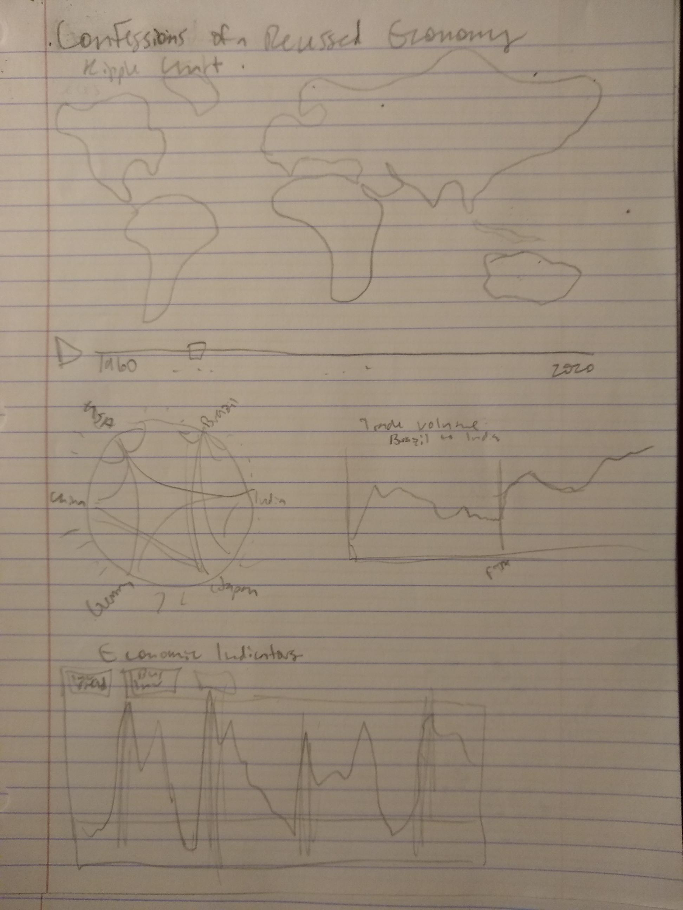
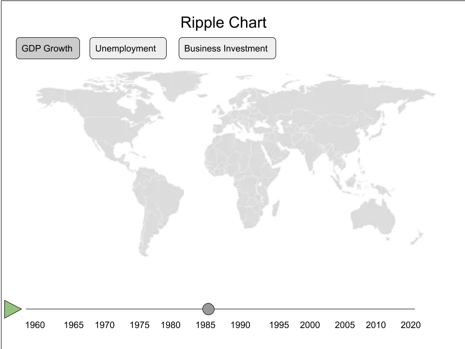
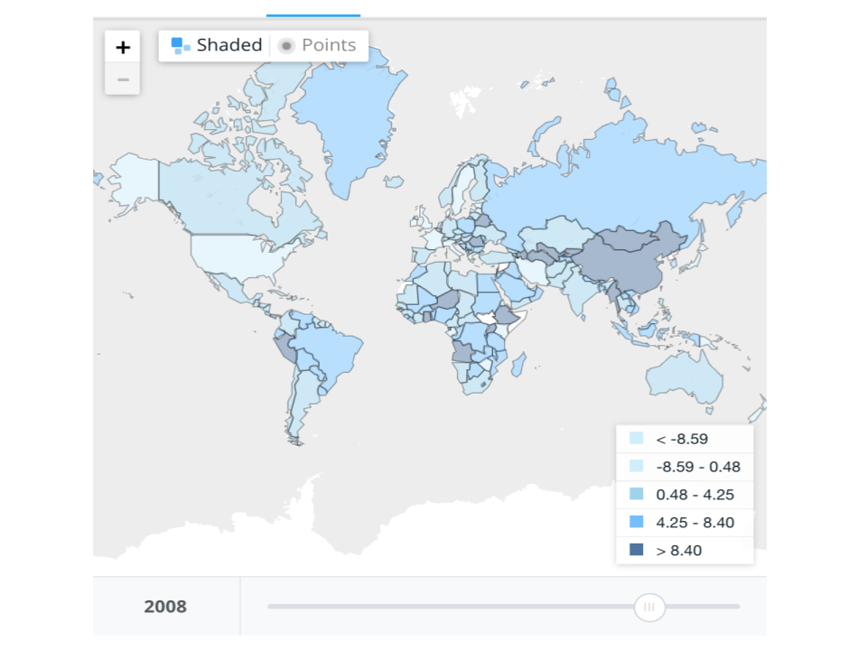
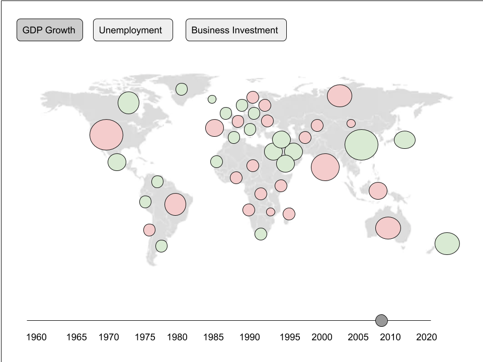
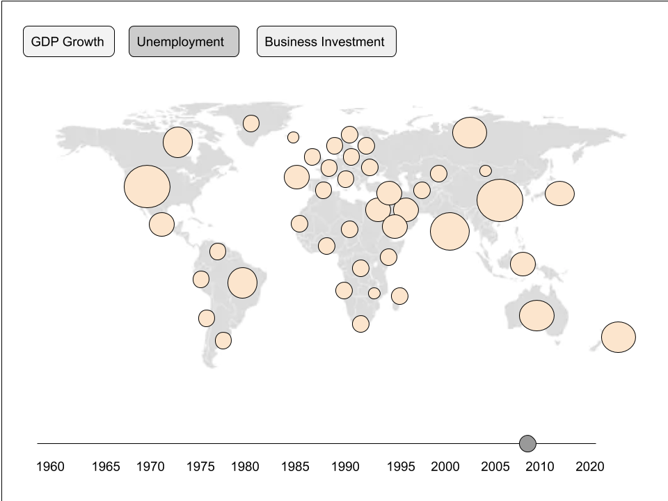
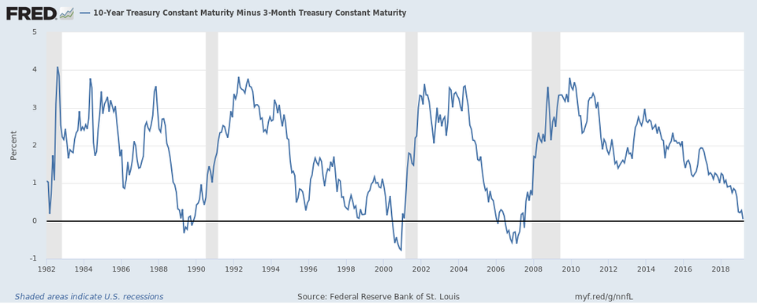
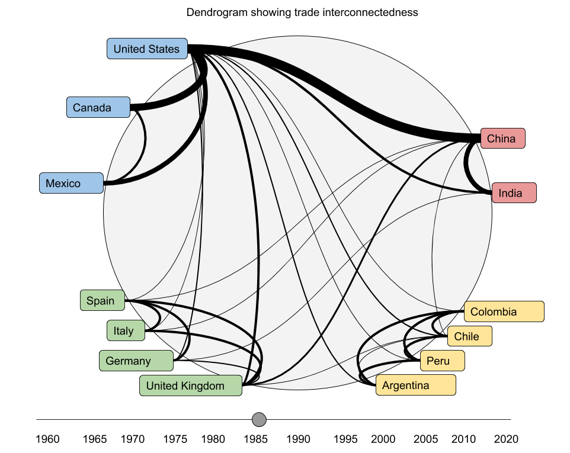

# Process Book

## Basic Info

_Title:_   
Confessions of a Recessed Economy

_Repository:_  
https://github.com/marwtki/the-dismal-science

_Team name:_  
The Dismal Science

_Team members:_  
Steven Scott  
steven.scott@aggiemail.usu.edu  
A01535109

Margaret Watkins  
margaret.watkins@aggiemail.usu.edu  
A01983706

## Overview and Motivation

For the average person, the economy is hard to understand. Economists are trusted little and liked less. The economy is a powerful force in our nation, community, and daily life. Despite its importance, politicians and voters alike have very limited understanding of economic principles and the effect of economic policy and mishaps. We believe an enhanced understanding of economic indicators and history will inform the general population and assuage fear of the unknown. 

While data visualization will not prevent the next recession, it can shed light on why current events are happening and what the future may bring. Economic indicators such as an inverted yield curve and declines in business investment lead business cycles and show that we may be headed into another recession right now. If so, the damage would reach far beyond the borders of the United States, and global recovery may take longer than we think.

We believe this information can and should be presented in ways that are easy to understand, even for those who are not trained economists. As dual majors in Economics and Computer Science, we know from experience that learning about the economy can lead us to care more and fear less. Our economics coursework has taught us how to understand the data we will visualize in this project and has inspired us to share the understanding we ourselves have gained.

## Related Work
Our economics coursework has changed our perspective on domestic economic policy. Feeling enlightened ourselves, we wanted to share some of this insight with others who haven't had the chance to endure the classes we have.

The vis itself were inspired in part by a desire to improve the FRED's graphs and make them accessible, and by this awesome hierarchical edge bundling https://observablehq.com/@d3/hierarchical-edge-bundling.

## Project Objectives: Questions

Primary questions we would like to answer with our visualization:

- How quickly and strongly are countries around the globe affected when the one country enters a recession? (difficult to answer with our data)
- How long does it take for these countries to recover relative to the country that triggered the recession? (also difficult to answer)
- What stories can we find by looking at world economic data? (A question we developed)
- What economic indicators are correlated with recessions in the United States?
- What economic indicators show that we may be headed into a recession?
- Where are these indicators at right now?
- When have recessions happened in the past and how severe were they?
- Why is the trade war with China hurting the economy?
- How much do nations of the world care about free trade? (A question that evolved as we implemented our optional dendrogram)

Benefits:
- Develop a general understanding of how recessions happen based on economic indicators
- Learn when recessions have happened in the past century and how severe they were
- Show the current state of the United States economy
- Understand the links between national and global economies
- Build compassion for other countries who have recessions triggered by the United States
- Understand why President Trump's international relations are causing economic strain

## Data

Datasets currently included:

#### From OECD - Organisation for Economic Co-operation and Development
- Quarterly National Accounts  : Quarterly Growth Rates of real GDP, change over previous quarter (https://stats.oecd.org/Index.aspx?DataSetCode=QNA_ARCHIVE#)
- Key Short-Term Economic Indicators  : Harmonised Unemployment Rate (https://stats.oecd.org/Index.aspx?DataSetCode=QNA_ARCHIVE#)

#### From FRED - Federal Reserve Bank of St. Louis
- NBER based Recession Indicators for the United States from the Period following the Peak through the Trough (https://fred.stlouisfed.org/series/USREC)
- Real Gross Domestic Product (https://fred.stlouisfed.org/series/GDPC1)
- 10-Year Treasury Constant Maturity Minus 3-Month Treasury Constant Maturity (https://fred.stlouisfed.org/series/T10Y3MM)
- Gross Private Domestic Investment (https://fred.stlouisfed.org/series/GPDI) 
- Unemployment Rate (https://fred.stlouisfed.org/series/UNRATE)

#### From DESTA - Design of Free Trade Agreements
- List of treaties in dyadic form (https://www.designoftradeagreements.org/downloads/), which we cite under their instructions:  
Dür, Andreas, Leonardo Baccini and Manfred Elsig. 2014. “The Design of International Trade Agreements: Introducing a New Database”. Review of International Organizations, 9(3): 353-375.

### Data Processing

All of these datasets were downloadable in CSV format. For most of them, we used D3's CSV parser, and minimal additional data processing was needed. The US recession dataset contained a flag for every month indicating if it was a recession or not; this was converted into a much smaller dataset in which each item is a recession (with start and end dates) intead of a month.

We have also included a dyadic dataset of bi- and multilateral free trade agreements for our optional dendrogram. The src/resources directory contains python scripts we wrote to parse the CSV and construct a JSON hierarchy of regions and countries of the world using the identifiers in this dataset. The free trade agreements signed are then included under one of each pair of countries that signed it. This tree structure in JSON format enabled us to use hierarchical edge bundling with a radial dendrogram. The JSON file we generated is in the src/data directory. 

## Exploratory Data Analysis: 

Initially we tolerated some online vis provided by our data sources to understand the data. Having also studied economics for some time, we had a decent idea that the yield curve would invert and business investment would decline before each recession, and that these have occured this year as well. We were interested to see that unemployment, which typically begins to rise before a recession, is currently still dropping. This contrasts to the other two indicators in the vis and for the sake of showing the data, the whole data, and nothing but the data, we decided it would add interest and accuracy to the vis to include unemployment as well. We expect that the global datasets will provide more surprises as we continue to explore the data through the map and slider vis we are building.

## Design Evolution

### Overview
Since we are creating a dashboard-style vis, there are multiple visualizations put together to communicate a complex message in an understandable format. This overview shows how the multiple views will fit together. Note that the year slider controls the year for all of the charts. This allows the user to see how different economic values are related to each other and how they evolve in tandem over time. 

### Ripple Vis
This chart is a central part of the recession visualization. The intended use is for the user to explore how recessions in one country spread/impact other countries in the world. This can be accomplished by dragging the scrubber or clicking a play button and watching the vis transition over time. Due to its central nature, several variations and views are included in this proposal. 

#### Ripple Vis Basic

This is the basic template for the ripple chart vis. Pretty much, this is the set of elements that we're planning on including in the ripple vis, with other maps showing different alternatives for how the data is encoded.

#### Ripple Vis GDP Colored 

This vis is one alternative for the ripple vis's GDP Growth view. In this variation, each country's GDP Growth rate is encoded using color. Positive GDP Growth will be colored green. Negative GDP Growth will be colored red. The value of these colors is scaled by the degree to which GDP Growth is positive or negative. 
* “GDP Growth (Annual %).” Data, https://data.worldbank.org/indicator/ny.gdp.mktp.kd.zg?view=map.

#### Ripple Vis GDP Circles

In the above alternative for GDP Growth Rate, the user might be decieved because the amount of green/red on the map is more related to the land area of the countries, instead of the actual economic conditions. This effect is somewhat mitigated by the United States and China, who have both large economies and large land areas. However, if we are still worried about the landmass effect, we could create circles for each country and dual-encode the GDP growth data using both the color and the size of the circle. 

#### Ripple Unemployment

This sketch shows what would happen if the clicked on the "Unemployment" button. The circles would change to all be the same color. Orange is used because it is somewhat similar to red, but less severe. Increasing unemployment is bad, but some unemployment is not as bad as slightly negative GDP growth. 

### Yield Curve Inversion Chart for the United States

This is a pretty straight-forward chart and many versions of it have been created by economists, businesspeople, and magazines. Instead of creating a sketch, we included a version of the chart from Forbes. The chart displays the difference between the 10-year return on Treasury bonds and the 3-month  return on Treasury bonds. Periods of recession are shown in the chart using grey boxes. 
* S. Moore, “The Yield Curve Just Inverted, Putting The Chance Of A Recession At 30%,” Forbes, 28-Mar-2019. [Online]. Available: https://www.forbes.com/sites/simonmoore/2019/03/23/the-yield-curve-just-inverted-putting-the-chance-of-a-recession-at-30/#4718c9af13ab. [Accessed: 10-Nov-2019].

For our project, we will improve this chart in several ways, as listed below:
* Hovering over the title of the chart will display a tooltip with a basic explanation of why the chart is important and how to interpret the vis.
* Hovering over a recession box will display a tooltip with some information about that particular recession - how long the recession lasted, the difference between unemployment before the recession and unemployment at its peak during the recession. 

### Trade Interconnectedness Chart

Possibility - we're still undecided about this one. The goal would be to allow the user to see how the degree of global interconnectedness impacts the degree to which a financial crisis spreads between countries. The slider would be connected to the ripple chart slider so that both charts display the same year. 

The volume of trade between two countries would be shown using the the weight of the line connecting the two countries. We could also duplicate that encoding with the value of the line. To decrease clutter, countries will be grouped by continent and bundled accordingly. 

## Must-Have Features

- Charts displaying leading/trailing indicators of a recession:
  - Business Investment
  - Yield Curve (10-year treasury bond vs. Fed rates)
  - Unemployment
- Ripple Chart(s)
  - Chart(s) displaying how an economic downturn in a large economy (particularly a global hedgemon) propogates around the world. This chart/these charts should support the following views:
    - GDP Growth
    - Unemployment

## Optional Features

- Extra Ripple Charts/Views: 
    - Purchasing Power Parity
    - Inflation
    
- Free Trade Agreement Vis:
    - Interactive radial dendrogram with countries as nodes and links indicating an FTA between them
    - Slider for years to show change over time
    - On hover over a link, show accompanying line chart showing volume of trade over time as net exports in real USD 
    - This can help explain why President Trump's trade war with China is hurting the economy

- Happiness Vis:
    - Goal is to analyze how recessions impact happiness measures such as OECD's Life Satisfaction Index
    - Visualize if the index measures are the same before/after recessions in different countries
    - Which countries take longer to recover?
    - Ideas: Line chart showing happiness over time by country, bar chart showing how long it takes happiness to recover in different countries after a recession, scatterplot showing correlation (or lack thereof) between happiness and length of recession

- Year Comparator Vis:
    - Show 2 copies of map so you can compare 2 years at once
    - Alternately, choose a base year in a single map and show data relative to that year

## Intended Project Schedule

Week 0: Nov 3 - 9:
* Meet with Dr. Edwards to discuss proposal 
* Create project structure (data directory, scripts directory, etc)
* Write Proposal
  - Write this document
  - Draw layouts, rough sketches of vis
* Implement layout structure in html

Week 1: Nov 10 - 16:
* Turn in Proposal (Monday)
* Add World Map to Vis (Steve)
* Implement Business Investment Line Chart (Margaret)

Week 2: Nov 17 - 23:
* Put the datasets in (Margaret)
* Implement Yield Curve Inversion Chart (Margaret)
* Implement Unemployment Chart (Steve)
* Add scaled colors for GDP growth rate to World Map (Steve)
* Attempt Unemployment Ripple Chart (Steve)
* Write script to create countries hierarchy for dendrogram (Margaret)

Week 3: Nov 24 - 30:
* Attempt to find more robust life satisfaction dataset and add to map (team)
* Implement year slider (Steve)
* Implement play button (Steve)
* Look into map projection solutions (different projection? Cartogram?) (team)
* Add question icons and basic descriptions of economic concepts (Margaret)
* Add tooltip to indicators chart and maybe highlighting (Margaret)
* Attempt FTA dendrogram for current year (team effort)
* Attempt dendrogram change over time (Margaret)
* Attempt linked FTA trade volume vis (Steve)
* Write report (team)

Week 4: Dec 1 - 7:
* Style project to be beautiful with css (team)
* Finalize project, fix outstanding bugs, code clean up (team)
* Prep for Presentation
* Present
* Make screencast
* Finish process.md

Week 5: Dec 8 - 14
* Take finals

# Project
## Design Evolution: 
_What are the different visualizations you considered? Justify the design decisions you made using the perceptual and design principles you learned in the course. Did you deviate from your proposal?_

_First Chart_  
Our original intention was to provide a 'ripple' visualization, in which the user could see a waverfront of negative GDP growth spread out from a point of origin to countries with connected economies. However, the data were not sufficiently granular for this type of visualization. The economies of the United States and Europe are so inter-connected that economic conditions spread in less than a quarter. With data sampled once at the beginning of each quarter, it was not possible to create a wavefront. 

With this discovery, we pivoted. Instead of focusing on the waverfront idea, we gave the user increased control over the map visualization, turning it into a debugger of sorts. The point of the debugger is for the user to explore the data, looking for interesting moments in history. 

We considering switching the world map to be a cartogram, with country size scaled by GDP and colored by GDP Growth. The advantage of this switch would have been that countries with more of an impact on the global economy would have been emphasized in the vis. However, when we explored this option by looking at http://bl.ocks.org/emeeks/d57083a45e60a64fe976, it became apparent that the distortion would create several problems. European countries become unrecognizable as they grow. Given our dataset, Africa would have disappeared entirely. 

We also considering making the map visualization have circles scaled by GDP and colored by GDP Growth. This would have prevented the user from confusing land-area with impact on the world economy. We had several concerns with this technique, though. Europe would have been crowded and could have some occlusion issues, as many European countries have relatively large GDPs and small land areas. Additionally, this technique would make the vis more intimidating for a first-time user.

_Second Chart_
We succesfully implemented the chart in our proposal plus some extra features. We started with the basic line charts. When scaling the line charts, we used banking to 45 degrees for the unemployment and investment lines to facilitate their interpretation. 

We styled the vertical recession and current-time marks with opaque red for recessions to show that they are important and undesirable, and to draw attention to what happens in the graph around the recessions. The current-time mark is not opaque; it is bold blue to attract attention and suggest to the user that they pay attention to what is happening around the current time. These are the only uses of color in the vis. Our goal with this styling was to help the user answer questions about how close the next recession is, even before they realize that's what their purpose is with these charts.

We considered adding highlighting to the regions of the line chart just before each recession, but decided against it. Our purpose is not to impose a story on the user; the data speaks for itself. We wanted to show the data, the whole data, and nothing but the data.

We added basic descriptions of the economic terms, but again, the graph is designed to allow the user to draw conclusions about the proximity of the next recession even without this economic context.

We considered animated transitions between the 3 line charts, but opted for jump cuts to minimize distraction. We didn't need animation to maintain context, as the year axis and the recession marks stayed the same.

We deviated from our proposal by adding a static line chart at the top showing real GDP. We felt this would help provide context; it is the only measure of the size of the economy that we visualize anywhere in our project. Elsewhere, we focus on rates of growth. We kept this chart small and opaque so that it can be used for reference, but so the user looks first to the brighter and larger chart underneath.

An interactive tooltip shows the data values on hover.

_Third Chart_
After seeing in the second chart that the yield curve inverted and investment declined recently, the user might wonder why. According to our economic training and reliable sources like the Fed, these economic indicators reflect uncertainty in the business world about the future of trade - uncertainty influenced by the trade war that President Trump has begun with China.

We wanted to communicate to the user the importance of international cooperation and free trade for promoting economic growth. In leiu of economic diagrams showing deadweight loss and other economic concepts, we chose to visualize the interconnectedness of the world through free trade agreements (FTA's) signed. Our dream is to one day link this chart to a visualization of trade volume over time for selected countries.

FTA's can be bilateral (between 2 countries) or multilateral (between more than 2 countries). In vis terms, our dataset was a hypergraph, with some edges connecting multiple nodes. To represent this hypergraph, we show a link between each pair of nodes connected by a given edge. In the context of free trade, this is sensible because while many countries may sign one trade agreement, they don't do 3- or 4-way trades of goods after signing. Purchase of goods occurs between just two countries at a time.

We used a dendrogram for visual interest, with hierarchical edge bundling to reduce clutter and facilitate discernment between trade amongst and trade within large geographical regions. Our inspiration and code tutorial was from Mike Bostock at https://observablehq.com/@d3/hierarchical-edge-bundling. We wrote a couple of python scripts to parse the raw dataset and create the hierarchy we needed.

Clicking on countries filters the data by those countries. Data shown can be cumulative or for just the selected year.

The quantity of edges in the dendrogram surprised us. Initially there were over 17000. The occlusion problem and slow rendering time motivated us to implement the filtering we described, by year and by country. 

## Implementation: 
_Describe the intent and functionality of the interactive visualizations you implemented. Provide clear and well-referenced images showing the key design and interaction elements._

### Intent and Functionality 
When the user first navigates to the visualization, she is presented with the map visualization set to a date in the early 2000s. This gives the user some context for what she is looking at: the vis already is showing a view of the data, the scale, and the navigation buttons. The Play button is the first element after the vis. This was done in the hope that if a user doesn't know what to do, she will click the first available button and watch the vis scroll through the last decade of data. This gives a general sense of how the vis is to be used and will highlight some interesting sections of recent history. 

After the user has played through part of the data, she can then use either the slider or the jump-to input box to go to a moment she wants to explore. From there, she can step through the data, quarter by quarter or year by year, to explore the details of what is happening. Unlike most debuggers, this particular vis allows the user to step backwards, decreasing the amount of memory it takes to keep track of what is going on. 

Hopefully, the map part of the visualization will spark some interest in economic stories present in the data. The second part of the visualization 

### Mishaps
#### Sliders: Annoyingly Problematic
The year slider was suprisingly fraught with pitfalls. Slider support varies widely by browser and label support is spotty at best. The effort to use the existing HTML slider element was, in the end, about the same amount of work it would have been to build an svg-based slider from scratch in d3.

## Evaluation: 

### Lessons from the Data
We were somewhat surprised to learn that unemployment undergoes much less fluctuation in European countries during a recession than it does in the United States. This is likely because employment law in Europe makes it more difficult for businesses to fire employees, even when profits fall. 

It was also interesting to note in the Indicators Chart that unemployment in the United States has not ticked up to match the yield curve inversion, as it typically has before past recessions. This gives a somewhat mixed view of the current US economy.

We were thrilled to see just how many free trade agreements there are in the world! And disappointed and shocked to see how few the United States has. At first we thought it was a mistake in the data or a bug in the vis. However, further research showed that the data and vis are accurate. The US government proudly announces that it has 14 FTA's with 20 countries (https://www.export.gov/article?id=U-S-Free-Trade-Agreements--Introduction).

### How Well the Visualization Works
The Visualization is very effective in sparking interest in the data, highlighting some concerning economics trends in the United States, and in allowing some exploration of free-trade data. In particular, the following parts of the visualization were very effective:
* The pop-out effect of countries experiencing negative GDP Growth rate was very effective in drawing the user's attention to interesting parts of the GDP Growth data
* The Play and Stop buttons provide a very simple way for a user with no idea on how to interact with the visualization to begin exploring the interesting parts of the data.
* Stepping through the data allows the same map visualization to provide additional depth to data exploration without changing the data encoding.
* The Indicators chart does a great job in showing the user several historic patterns that provide context for the current situation in the United States.
* The Indicator chart is quite effective in showing the importance of indicators and in giving a basic explanation of what the indicators mean.
* The Indicators chart is focused and doesn't use unjustified color.
* The real GDP section of the Indicators chart seems to be a flop. Out of friends we have shown it to, only one has really liked it and the rest appeared to be confused. This is great feedback for us and we would remove or improve it in future iterations of the project.
* The Free Trade Chart allows the user a large degree of freedom in exploring free trade agreements. Filtering is key to this exploration. 
* Rendering time gets slow as cumulative data up to more recent years is shown. Even with preprocessing the data to the point of generating the SVG path attribute and storing that string for each FTA, simply displaying all those edges takes a lot of computational effort.
* Free Trade chart as it stands communicates really well the sheer number of trade agreements. This is excellent for our purposes. It gives no information about what agreements they are or the actualy effect on trade volume, which is a major shortcoming.
* While we understand the connection between current trade tensions and the current US economic state, we could communicate that conceptual link better to the user. Our title "Current trade tensions matter" alludes to the trade war with China, but it's still a big jump for the user to make.
* One friend who saw the vis has repeatedly brought it up in conversation since, and is reconsidering his personal financial plan in light of his new understanding of recessions. We consider this a success.
* People seem to find the vis as a whole interesting and fun to look at.

### Further Improvements
If we had more time, there are several things that would have helped improve our visualization. We could have added a Trade Quantity visualization next to the Free Trade Agreement Visualization. These would have been complementary visualizations, allowing the user to see how a free-trade agreement impacts the quantity of trade between two nations. 

We also would love to redundantly encode the continent with hue on the dendrogram to make it easier to see quickly. In addition, we want to show the names of free trade agreements when you hover over it, or in a list on the side.

We also could have some small-multiple charts that would appear next to the map when countries are selected. These line charts would give the user a sense of how much fluctuation there is in the GDP Growth for a selected country. It would decrease the cognative load of trying to remember the fluctuations as the vis plays through the available years. 

We could reign in our use of color. Not all our color use is color-blind safe and not all of it is justified.

We can also position the vis better horizontally so that everything isn't squished up against the left side of the screen.

We still dream of the ripple chart in our proposal. We would love to investigate more granular data sources and perhaps consider other measures of aggregate economic activity to make that possible.

_Thank you for experiencing The Confessions of a Recessed Economy_
